# Employee Expense Management System (EEMS)

The Employee Expense Management System (EEMS) is a web application designed to streamline the process of managing employee expenses. It includes features for adding, viewing, reviewing, and paying expenses, as well as managing users and roles within the system.

## Features

### 1. Login Page
The Login Page serves as the gateway to the Employee Expense Management System (EEMS). Users must enter their credentials to access the system. It features secure authentication mechanisms, including password hashing and protection against brute force attacks, ensuring that only authorized personnel can access sensitive financial data.

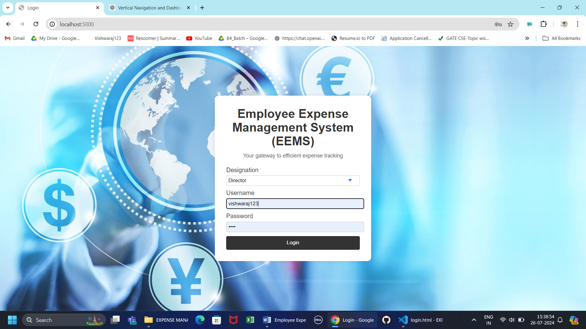

### 2. Add Expense
The Add Expense function allows employees, managers, and admins to submit their expenses for approval. Users can enter details such as expense type, amount, date, and description. The system supports uploading receipts or other documentation, making it easier to verify and process expenses.

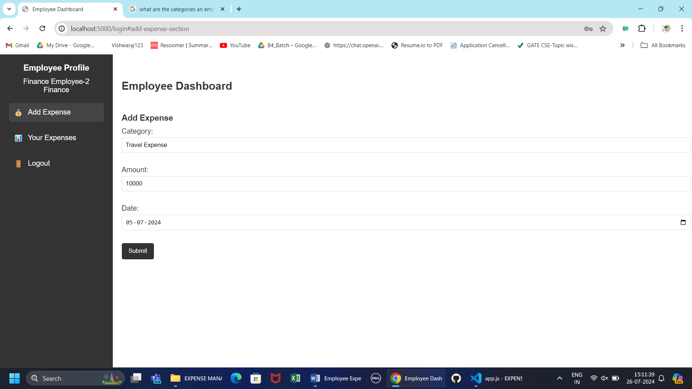

### 3. View Expense
The View Expense feature provides users with a comprehensive overview of their submitted expenses. They can track the status of each expense, view details, and see a history of approvals and rejections. This transparency helps users stay informed about the progress of their reimbursement requests.

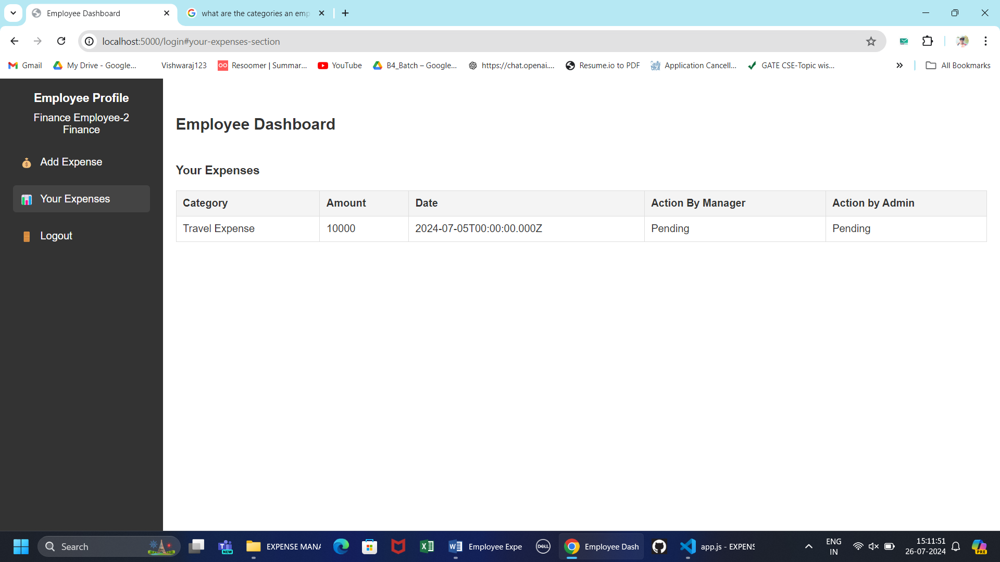

### 4. Review Expense
The Review Expense function allows managers, admins, and directors to review and approve or reject submitted expenses. The function provides a detailed view of each expense report, including attached receipts or documentation. This ensures that the approval process is thorough and based on accurate information.

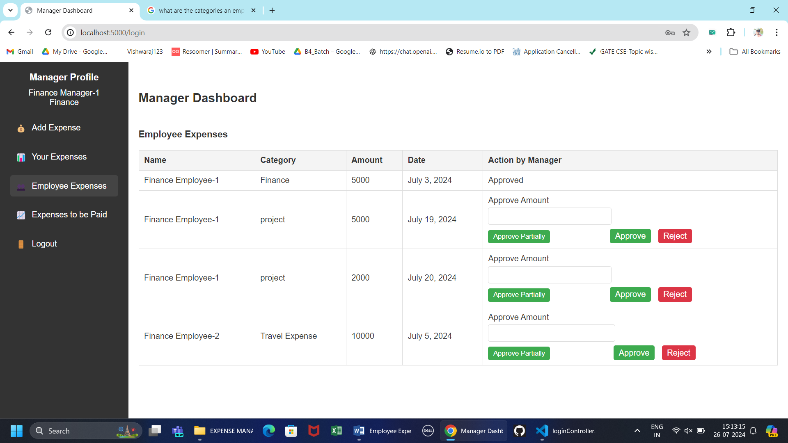

### 5. Pay Expense
The Pay Expense function is managed by the finance department, allowing them to process payments for approved expenses. This function includes updating the payment status and recording transaction details, ensuring that employees are reimbursed promptly and accurately.

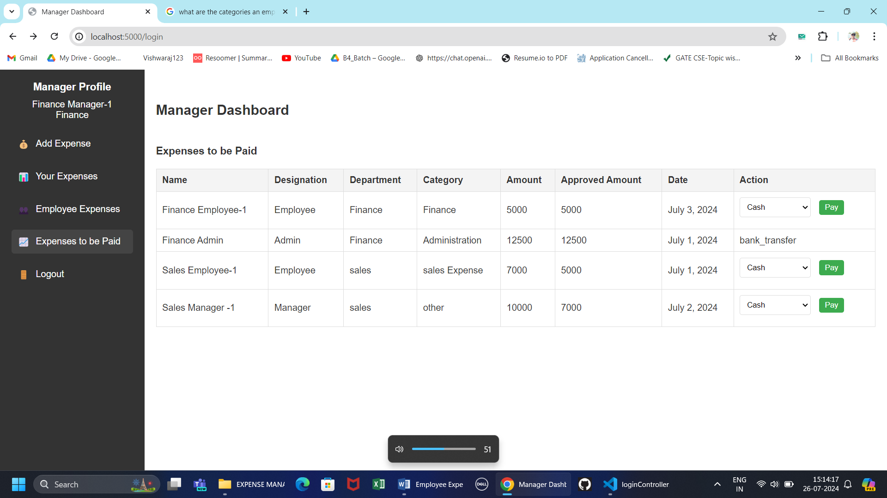

### 6. Add Employee
The Add Employee function, primarily available to HR managers and directors, enables the addition of new employees to the system. This includes inputting personal and professional details, assigning roles, and setting initial permissions, ensuring that new hires are integrated smoothly into the EEMS.

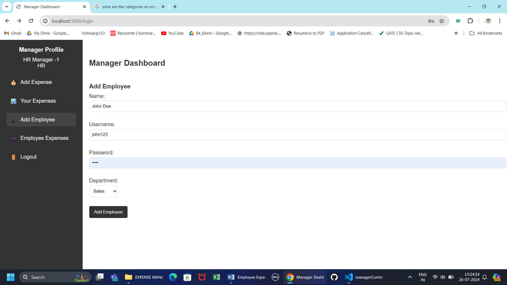

### 7. View Employees
The View Employees function provides a comprehensive list of all employees within the organization. Authorized users can view detailed profiles, including contact information, department, and submitted expenses. This function aids in managing and overseeing the workforce effectively.

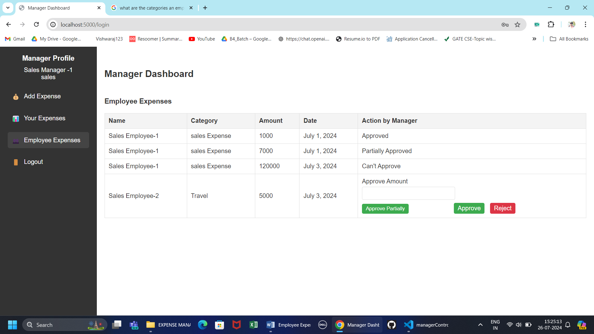

### 8. View Managers
The View Managers function lists all managers, providing insights into their respective departments and managed employees. It includes detailed profiles and their expense approval histories, helping directors and admins monitor managerial activities and performance.

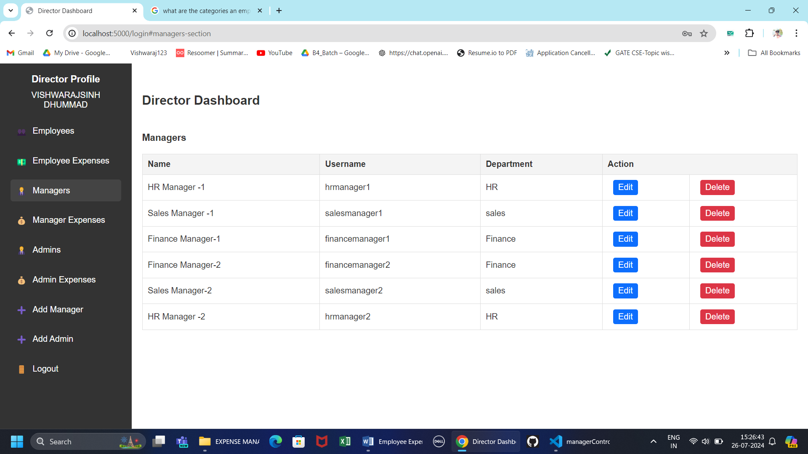

### 9. View Admins
The View Admins function lists all administrative personnel, detailing their roles and responsibilities within the EEMS. It includes their profiles and a history of expenses they have approved or rejected, ensuring transparency and accountability in the administration.

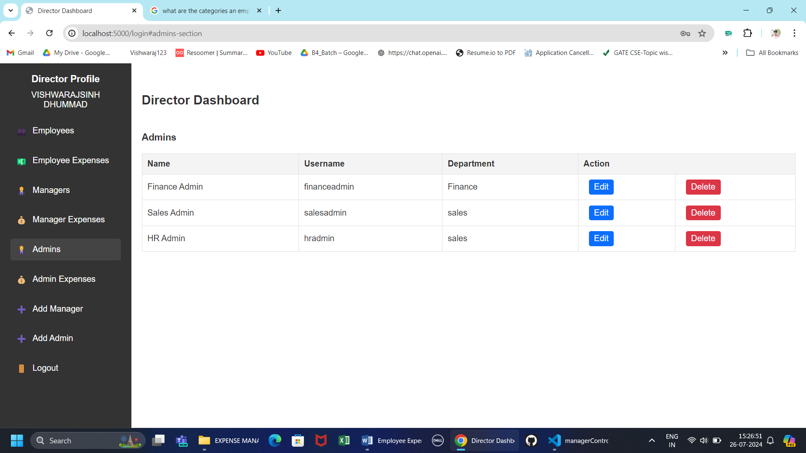

### 10. Edit User
The Edit User function allows authorized users to modify the profiles of employees, managers, admins, and directors. This includes updating personal information, changing roles or permissions, and managing user status, ensuring that the system's data remains current and accurate.

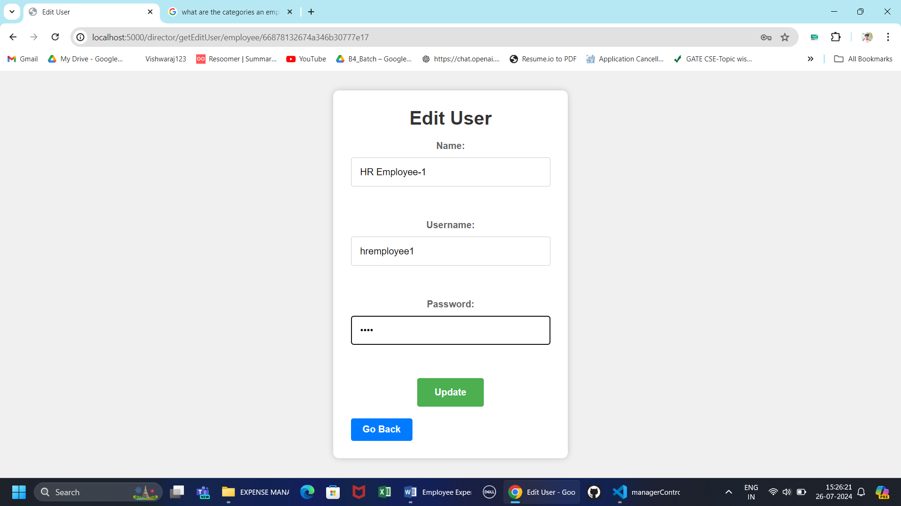

### 11. Add Manager
The Add Manager function, available to directors, facilitates the addition of new managers to the system. This involves entering relevant details, assigning them to departments, and setting their approval permissions, ensuring that new managers can effectively oversee their teams and approve expenses.

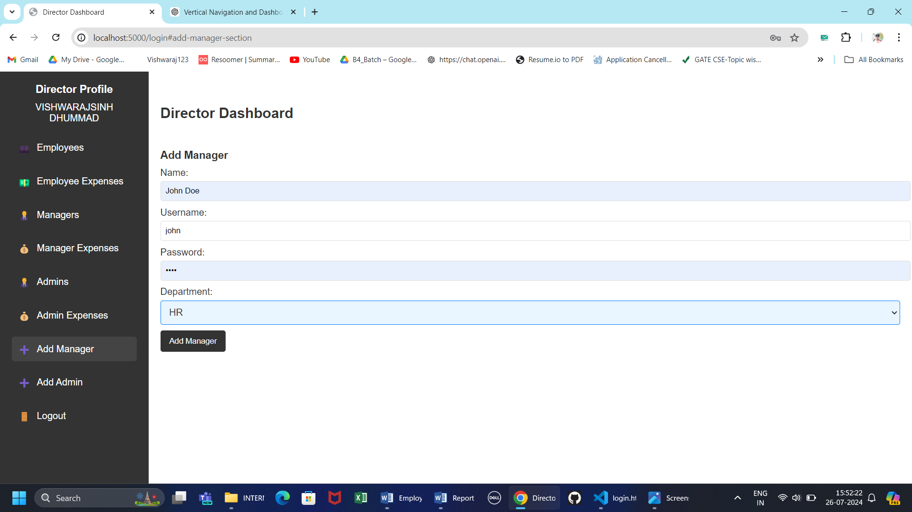

### 12. Add Admin
The Add Admin function enables directors to add new administrative personnel to the EEMS. This includes entering necessary information, defining their roles, and setting their permissions, ensuring that the system's administrative tasks are well-managed and supported by competent staff.

